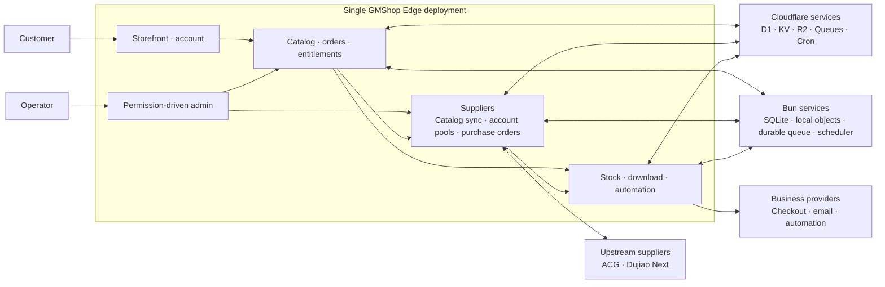

# GMShop Edge

**Digital goods, delivered from the edge.**

[简体中文](README.zh-CN.md) · English

[](LICENSE)
[](#architecture)
[](https://bun.sh/)
[](https://www.typescriptlang.org/)
[](https://react.dev/)
[](https://tanstack.com/start)
[](#architecture)
[](https://www.better-auth.com/)
[](https://vitest.dev/)
[](https://visulima.com/packages/email)
[](project.inlang/settings.json)

GMShop Edge is a self-hosted, single-deployment, single-tenant digital-goods
storefront for Cloudflare Workers or a Bun/Nitro Docker container. One
deployment provides a responsive public shop, customer accounts, checkout and
fulfillment, and a permission-driven administration console.

> [!IMPORTANT]
> GMShop Edge is under active development. A built-in adapter means that its
> integration path is implemented; production use still requires
> deployer-owned provider credentials, backups, monitoring, and real-provider
> acceptance tests.

## Core capabilities

- Sell stock products that atomically allocate encrypted preset text such as
  license keys, accounts, activation codes, or credentials.
- Synchronize upstream products from ACG `3.5.5` V4 Open API or Dujiao Next
  `v1.3.1`, then fulfill through an equal-priority account pool for each API
  source.
- Grant authorized, bounded access to private download files stored in R2.
- Dispatch automation products for deployments, scripts, resource provisioning,
  or build workflows, with `none | optional | required` artifact policies.
- Combine permanent, fixed-term, limited, unlimited, free, one-time, and
  customer-renewed entitlement policies without floating-point money.
- Support guest and registered checkout, private order lookup, coupons, refunds,
  after-sales handling, and operational retention.
- Keep one commerce identity model: registered ownership references Better Auth
  users directly, while guest orders use a verified checkout email until a
  matching verified account claims them. No shadow account or separate customer
  table is created.
- Deliver template-based transactional email through five `@visulima/email`
  providers—SMTP, Resend, Postmark, SendGrid, and Mailgun—plus the native
  Cloudflare Send Email binding. Email records retain delivery state while
  Queue/Cron provides bounded retries.
- Quote customer-selected fiat currencies from store-owned D1 exchange rates and
  pass one immutable quote to Stripe, GMpay, EPay, or another typed adapter.
- Configure email/password, social, OIDC, and Telegram authentication providers
  at runtime through Better Auth without rebuilding the Worker. Telegram web
  login supports both OIDC code callbacks and verified `#tgAuthResult` Widget
  fallback while storing the OIDC client secret separately from the Bot Token.
  Telegram Mini Apps use verified `initData` for automatic sign-up/sign-in,
  request full screen through `@tma.js/sdk`, and import a missing Telegram
  avatar. Telegram users can bind a verified email independently from setting
  a password.
- Synchronize a grammY webhook bot with localized shop commands and fixed Mini
  App buttons. Optional customer support maps each Telegram user to a Forum
  Topic, forwards messages in both directions without storing their content,
  trusts only current group administrators, and closes idle conversations.
- Protect `/admin` with dynamic multi-role RBAC, a non-removable root invariant,
  server-side permission checks, reauthentication, and audit records.
- Provide responsive light and dark themes, keyboard access, and two UI locales:
  English (`en-US`) and Simplified Chinese (`zh-CN`).
- Persist each user's preferred language for account and transactional email;
  guest orders retain the checkout locale as a notification fallback.

Every GMShop Edge capability listed above is part of the open-source project;
there is no closed Pro or Enterprise tier.

## Architecture



One Worker or Bun container owns the public, customer, and administrative
surfaces. Each deployment has one authoritative database: D1 on Workers or
`$GMSHOP_DATA_DIR/gmshop.sqlite` on Bun. Workers use KV, private R2, Queues,
and Cron; Bun provides the same runtime interfaces with a bounded memory
cache, hashed local private objects, a durable SQLite queue, and an in-process
scheduler. Background work keeps catalog synchronization, supplier purchasing
and reconciliation, fulfillment, retries, retention, and key rotation outside
synchronous requests. The supplier module synchronizes one catalog per
provider and API source, automatically selects from the eligible account pool
for that source, and passes upstream content through the unified delivery-record
pipeline.

Routes remain thin; feature pages, schemas, server functions, and domain
behavior live in `src/features`, cross-domain runtime plumbing lives in
`src/server`, and the clean-install Drizzle baseline is
`drizzle/0000_gmshop.sql`.

## Deploy to Cloudflare Workers

GMShop Edge deploys as one Worker with D1, KV, private R2, one commerce Queue,
its dead-letter Queue, the optional Cloudflare Send Email binding, and Cron
Triggers.

### Deploy button

[](https://deploy.workers.cloudflare.com/?url=https://github.com/GMWalletApp/gmshop-edge)

The guided flow requires a public source repository. Use `bun run build` as the
Build command and `wrangler deploy` as the Deploy command. The remote build
creates or reuses the named resources, applies D1 migrations, and generates the
deployable Worker configuration. After it finishes, open `/install` and create
the first root administrator.

### Deploy with Wrangler

Authenticate Wrangler, install dependencies, and deploy:

```bash
bun install
bunx wrangler login
bun run deploy
```

The `predeploy` hook creates or reuses the named D1, KV, R2, Commerce Queue, and
dead-letter Queue resources, applies the D1 baseline to the named database, and
builds the Worker. It injects resolved D1/KV IDs only into the generated
`dist/server/wrangler.json`; account-specific IDs are never written to the
portable `wrangler.jsonc`. Ordinary `bun run build` remains local and does not
contact Cloudflare.

After deployment, open `/install` on the Worker URL to initialize the instance.
Provider secrets are entered through the administration console and must never
be committed.

The deployment declares these bindings:

| Binding | Cloudflare product | Purpose |
| --- | --- | --- |
| `DB` | D1 | Authoritative identity, catalog, commerce, authorization, and audit data |
| `CACHE` | KV | Validated read caches and upstream-catalog snapshots |
| `FILES` | R2 | Private media, downloads, automation artifacts, and exports |
| `COMMERCE_QUEUE` | Queues | Asynchronous fulfillment, supplier, notification, and maintenance work |
| `EMAIL` | Send Email | Optional native Cloudflare email delivery |

`bun run build` remains a local Workers build and never discovers or modifies
remote resources. `bun run predeploy` performs remote preparation, migrations,
the Workers build, and generated D1/KV binding injection.

## Deploy with Bun and Docker

The public [GHCR package](https://github.com/orgs/GMWalletApp/packages/container/package/gmshop-edge)
supports `linux/amd64` and `linux/arm64`; no registry login is required.

Choose the image tag that fits the deployment:

| Tag | Use |
| --- | --- |
| `latest` | Recommended stable release |
| `1.0.0` | Fixed release that will not change unexpectedly |

### Docker Compose (recommended)

The repository includes a ready-to-use `compose.yml`:

```yaml
services:
  gmshop-edge:
    image: ghcr.io/gmwalletapp/gmshop-edge:latest
    restart: unless-stopped
    ports:
      - "3000:3000"
    environment:
      GMSHOP_DATA_DIR: /var/lib/gmshop
    volumes:
      - gmshop-data:/var/lib/gmshop

volumes:
  gmshop-data:
```

```bash
docker compose pull
docker compose up -d
```

### Docker command

Without Compose, run the same service directly:

```bash
docker volume create gmshop-data
docker run --detach --name gmshop-edge --restart unless-stopped \
  --publish 3000:3000 \
  --env GMSHOP_DATA_DIR=/var/lib/gmshop \
  --volume gmshop-data:/var/lib/gmshop \
  ghcr.io/gmwalletapp/gmshop-edge:latest
```

Open `http://your-host:3000/install`, confirm the public Origin and Allowed
Hosts, then create the first root user. Application, email, payment, supplier,
and automation settings remain in `/install` and `/admin`; they do not require
additional public container environment variables.

The non-root container listens on port `3000`. The `gmshop-data` volume stores
`gmshop.sqlite`, private objects, durable Queue state, and maintenance locks.
Keep it when updating or recreating the container. Check health with
`curl --fail http://127.0.0.1:3000/healthz`, follow logs with
`docker compose logs --follow gmshop-edge`, and update with:

```bash
docker compose pull
docker compose up -d
```

For source deployments, use Bun 1.3 with `bun run build:bun` and
`bun run start:bun`. The maintained `bun run data -- …` CLI provides
`backup`, `restore`, and `import-cloudflare`; restore and import accept only a
new or empty target and validate integrity before installing data.

## Releases and container images

Conventional feature and fix commits on `main` produce stable releases. Images
receive the exact version, major, minor, and `latest` tags. Each release updates
package metadata, creates a GitHub Release and tag, then calls the independent
Docker workflow. Native x64 and Arm64 runners build and smoke-test in parallel
before publishing a combined GHCR manifest with SBOM and provenance.

The Release workflow supports manual dispatch for an explicit branch. This is
also the recovery path when a pushed branch head intentionally contains a
GitHub Actions skip marker.

## Keep a fork synchronized

Forks include the `Sync upstream` GitHub Actions workflow. It runs every day at
00:00 and 12:00 UTC and can also be started manually from **Actions → Sync
upstream → Run workflow**. The workflow discovers the fork's parent repository
and merges the upstream default branch into the fork's default branch using
GitHub's fork sync API.

After creating a fork, open its **Actions** tab and enable workflows; GitHub
disables workflows in a new fork until its owner opts in. The workflow requests
only `contents: write` access from the repository `GITHUB_TOKEN` and does not
require a personal access token. It never force-pushes or overwrites fork-only
commits. A merge conflict fails the run and must be resolved manually before
automatic synchronization can continue.

## Quick start

### Requirements

- [Bun](https://bun.sh/) 1.3 or later
- A local environment supported by
  [Wrangler](https://developers.cloudflare.com/workers/wrangler/)

Install dependencies and start the local development server:

```bash
bun install
bun run dev
```

`bun run dev` applies pending migrations to the local `gmshop-edge` D1 database
and starts the application at <http://localhost:3000>. It does not migrate a
remote database.

Open <http://localhost:3000/install> on the first run. Installation creates the
first root administrator, protected built-in roles, runtime secrets, and
required settings. It does not create fake products, inventory, provider
credentials, or payment configurations.

After installation:

1. Confirm the detected application URL and configure exact Allowed Hosts.
2. Configure public branding, registration, authentication, email, commerce,
   fulfillment, retention, and provider settings in `/admin`.
3. Create a draft product, its sellable items, and stock, files, or automation
   configuration; review publish checks before making it public.
4. Configure a payment adapter and complete a real-provider acceptance order
   before opening the store.
5. Back up D1, private R2 data, and the runtime configuration.

## Technology stack

| Area | Technology |
| --- | --- |
| Runtime | Cloudflare Workers or Bun/Nitro Docker |
| Application | React 19, TanStack Start/Router/Query/Table/Form |
| UI | Tailwind CSS 4, shadcn/Radix |
| Authentication | Better Auth |
| Authorization | Project-owned dynamic RBAC with permission bit masks |
| Data | Cloudflare D1 or SQLite, Drizzle ORM |
| Runtime services | KV/R2/Queues/Cron or local cache/objects/durable queue/scheduler |
| Telegram | grammY, Telegram Bot API, Mini Apps |
| Internationalization | ParaglideJS |
| Tooling | Bun, strict TypeScript, Zod, Vitest, Biome, Wrangler |

## Development and quality

Common development commands:

```bash
bun run dev
bun run db:migrate:local
bun run generate-routes
bun run typecheck
bun run test
bun run check
bun run build
bun run build:bun
```

Run `bun run hooks:install` once per clone to enable the local Lefthook
Conventional Commit check. Its commitlint policy is declared in `package.json`.

After installing a local instance, populate idempotent acceptance fixtures with:

```bash
bun run seed:local
```

The fixtures cover products, stock, payment channels, customer orders and
entitlements, plus three supplier accounts across both supported platforms,
three bindings, three supplier-order states, and local catalog snapshots with
unimported SKUs for testing the all-sources list and bulk import. Orders and
entitlements belong to the installed `root@example.com`, whose local test password is reset to
`root@example.com`. Supplier accounts are
disabled, their API origins use `.example.invalid`, and automatic
synchronization remains off, so the seed cannot contact a real upstream.
The command also writes product media, downloads, automation artifacts, and
creates the local Telegram test user through the Telegram Mini App auto-sign-in flow.
Replace the credentials and explicitly enable accounts in the admin console for
integration testing. The script accepts `--local` only, preserves existing
rows, and cannot write to a remote D1 database.

Use `bun run db:generate` only when intentionally changing the Drizzle schema,
then review the generated migration. Normal development applies migrations; it
does not regenerate the clean-install baseline. Run `bun run generate-paraglide`
before checks that import generated messages without starting Vite;
`src/paraglide` is generated and ignored.

Before submitting a completed change, run the final quality gate on the same
working tree:

```bash
bun run typecheck
bun run test
bun run check
bun run build
bun run build:bun
```

Deterministic automated tests cover application behavior. Real payment, email,
Telegram, and automation-provider smoke suites remain manual and
unconditionally skipped; production acceptance must use deployer-owned
infrastructure.

## API contract

The interactive API reference is available at `/openapi` on a running
instance. Its machine-readable source is [OpenAPI YAML](public/openapi.yaml).

## Security

- Never commit `.dev.vars`, provider credentials, runtime secrets, private keys,
  or Cloudflare credentials.
- Configure exact Allowed Hosts, HTTPS, Origin and CSRF checks, rate limits,
  Queue/DLQ monitoring, administrator recovery, and backups before production.
- Private R2 objects are resolved through authorized D1 records; clients never
  choose object keys.
- Money is stored as decimal integer strings in minor units and never computed
  with floating point.
- Back up D1 and R2 before schema or retention changes, and test recovery rather
  than treating backups as complete when they have not been restored.
- Back up the complete Bun data directory before container upgrades; use the
  maintained data CLI rather than copying a live SQLite file.

## License

GMShop Edge is licensed under [GPL-3.0-or-later](LICENSE).
