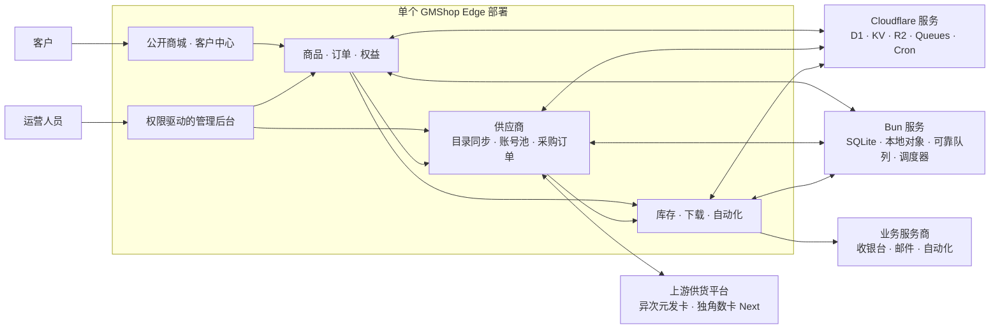

# GMShop Edge

**在边缘网络交付数字商品。**

简体中文 · [English](README.md)

[](LICENSE)
[](#系统架构)
[](https://bun.sh/)
[](https://www.typescriptlang.org/)
[](https://react.dev/)
[](https://tanstack.com/start)
[](#系统架构)
[](https://www.better-auth.com/)
[](https://vitest.dev/)
[](https://visulima.com/packages/email)
[](project.inlang/settings.json)

GMShop Edge 是可部署到 Cloudflare Workers 或 Bun/Nitro Docker 容器的自托管、单部署、
单租户数字商品商城。一个部署即可提供响应式公开商城、客户中心、结算与交付，以及基于
权限的管理后台。

> [!IMPORTANT]
> GMShop Edge 仍在持续开发。内置适配器表示相应接入路径已经实现；生产使用仍需要部署者
> 自己的服务商凭证、备份、监控和真实服务商验收测试。

## 核心能力

- 销售预置库存商品，原子分配加密保存的卡密、账号、激活码或凭证。
- 从异次元发卡 `3.5.5` V4 Open API 或独角数卡 Next `v1.3.1`
  自动同步上游商品，并通过同一 API 来源下的多账号池完成供应商履约。
- 授予对 R2 私有下载文件的鉴权、有界访问。
- 调度部署、脚本、资源开通或构建类自动化商品，并支持
  `none | optional | required` 产出策略。
- 组合永久、固定期限、限次、不限次、免费、一次购买和客户主动续购等权益策略，
  金额计算全程不使用浮点数。
- 支持游客和注册客户结算、私有订单查询、优惠券、退款、售后和运营保留。
- 统一商业身份模型：注册购买直接关联 Better Auth 用户，游客订单使用已校验的结算邮箱，
  待同邮箱账户完成验证后自动认领；系统不会创建影子账户，也不保留独立客户表。
- 事务邮件通过 `@visulima/email` 提供 SMTP、Resend、Postmark、SendGrid、Mailgun
  五种 Provider，并另接 Cloudflare 原生 Send Email binding；邮件模板负责内容，
  邮件记录保存投递状态，Queue/Cron 执行有界重试。
- 由商城在 D1 维护法币汇率，将同一份不可变报价交给 Stripe、GMpay、EPay 或其他
  类型化适配器。
- 通过 Better Auth 在运行时配置邮箱密码、社交、OIDC 和 Telegram 认证 Provider，
  无需重新构建 Worker。Telegram Web 登录同时支持 OIDC code 回调和经过服务端验签的
  `#tgAuthResult` Widget 兜底，并分别保存 OIDC Client Secret 与 Bot Token。
  Telegram Mini App 使用验签后的 `initData` 自动注册或登录，通过 `@tma.js/sdk`
  请求全屏并补齐缺失头像；Telegram 用户可独立绑定已验证邮箱，是否设置密码由用户
  另行决定。
- 同步由 grammY 驱动的 Webhook Bot，提供本地化商城指令和固定 Mini App 按钮；可选
  客服功能为每位 Telegram 用户映射一个 Forum Topic，双向转发消息但不保存内容，
  只信任当前群管理员，并自动关闭长时间无活动的会话。
- 使用动态多角色 RBAC、不可移除的 root 约束、服务端权限校验、再认证和审计保护
  `/admin`。
- 提供响应式深浅主题、键盘访问，以及英文（`en-US`）和简体中文（`zh-CN`）两种
  界面语言。
- 持久化用户偏好语言，用于账户和交易邮件；游客订单以结算语言快照作为通知回退。

GMShop Edge 全部功能均开源，不设置闭源 Pro 或 Enterprise 功能层。

## 系统架构



一个 Worker 或 Bun 容器承载公开、客户与管理入口。每个部署只有一个权威数据库：
Workers 使用 D1，Bun 使用 `$GMSHOP_DATA_DIR/gmshop.sqlite`。Workers 使用 KV、私有
R2、Queues 与 Cron；Bun 通过有界内存缓存、哈希化本地私有对象、SQLite 可靠队列和
进程内调度器提供相同运行时接口。后台工作将目录同步、供应商采购与核验、交付、重试、
保留清理和密钥轮换移出同步请求。供应商模块按“平台 + API 来源”同步一次目录，并在
同一来源的可用账号池中自动选择采购账号；上游返回的内容仍通过统一交付记录发放。

路由保持薄层；领域页面、schema、Server Function 和行为位于 `src/features`，跨领域运行时
编排位于 `src/server`，全新安装的 Drizzle 唯一基线为
`drizzle/0000_gmshop.sql`。

## 部署到 Cloudflare Workers

GMShop Edge 以单个 Worker 部署，并使用 D1、KV、私有 R2、一个 commerce Queue 及其
死信 Queue、可选的 Cloudflare Send Email binding 和 Cron Triggers。

### 一键部署

[](https://deploy.workers.cloudflare.com/?url=https://github.com/GMWalletApp/gmshop-edge)

引导流程要求源仓库公开。Build command 使用 `bun run build`，Deploy command 使用
`wrangler deploy`。远程构建会创建或复用具名资源、执行 D1 migration，并生成可部署的
Worker 配置。完成后访问 `/install` 创建首位 root 管理员。

### 使用 Wrangler 部署

登录 Wrangler、安装依赖并部署：

```bash
bun install
bunx wrangler login
bun run deploy
```

`predeploy` Hook 会创建或复用具名 D1、KV、R2、Commerce Queue 和死信 Queue，对具名
数据库应用 D1 基线并构建 Worker。解析出的 D1/KV ID 只注入生成的
`dist/server/wrangler.json`，绝不写入可移植的 `wrangler.jsonc`；普通
`bun run build` 始终是纯本地构建，不访问 Cloudflare。

部署完成后访问 Worker 地址的 `/install` 初始化实例。服务商秘密均从管理后台录入，禁止
提交到仓库。

部署声明以下 binding：

| Binding | Cloudflare 产品 | 用途 |
| --- | --- | --- |
| `DB` | D1 | 身份、商品、交易、授权与审计的权威数据 |
| `CACHE` | KV | 经过校验的读取缓存与上游目录快照 |
| `FILES` | R2 | 私有媒体、下载文件、自动化制品与导出 |
| `COMMERCE_QUEUE` | Queues | 异步交付、供应商、通知与维护任务 |
| `EMAIL` | Send Email | 可选的 Cloudflare 原生邮件投递 |

`bun run build` 始终只执行本地 Workers 构建，不发现或修改远程资源；
`bun run predeploy` 负责远程资源准备、migration、Workers 构建及生成配置中的 D1/KV
binding 注入。

## 使用 Bun 与 Docker 部署

公开 [GHCR 镜像](https://github.com/orgs/GMWalletApp/packages/container/package/gmshop-edge)
支持 `linux/amd64` 和 `linux/arm64`，拉取公开镜像不需要登录 Registry。

按部署用途选择镜像标签：

| 标签 | 用途 |
| --- | --- |
| `latest` | 推荐的稳定版本 |
| `1.0.0` | 内容不会意外变化的固定版本 |

### Docker Compose（推荐）

仓库已提供可直接使用的 `compose.yml`：

```yaml
services:
  gmshop-edge:
    image: ghcr.io/gmwalletapp/gmshop-edge:latest
    restart: unless-stopped
    ports:
      - "3000:3000"
    environment:
      GMSHOP_DATA_DIR: /var/lib/gmshop
    volumes:
      - gmshop-data:/var/lib/gmshop

volumes:
  gmshop-data:
```

```bash
docker compose pull
docker compose up -d
```

### Docker 命令

不使用 Compose 时，可以直接运行同一服务：

```bash
docker volume create gmshop-data
docker run --detach --name gmshop-edge --restart unless-stopped \
  --publish 3000:3000 \
  --env GMSHOP_DATA_DIR=/var/lib/gmshop \
  --volume gmshop-data:/var/lib/gmshop \
  ghcr.io/gmwalletapp/gmshop-edge:latest
```

访问 `http://your-host:3000/install`，确认公开 Origin 与 Allowed Hosts，再创建首位 root
用户。应用、邮件、支付、供应商和自动化设置仍在 `/install` 与 `/admin` 管理，不需要新增
公开容器环境变量。

容器以非 root 用户运行并监听 `3000` 端口。`gmshop-data` volume 保存
`gmshop.sqlite`、私有对象、可靠 Queue 状态及维护锁，更新或重建容器时必须保留。使用
`curl --fail http://127.0.0.1:3000/healthz` 检查健康状态，使用
`docker compose logs --follow gmshop-edge` 查看日志，使用以下命令更新：

```bash
docker compose pull
docker compose up -d
```

源码部署需要 Bun 1.3，并使用 `bun run build:bun` 构建、
`bun run start:bun` 运行。仓库维护的 `bun run data -- …` CLI 提供 `backup`、
`restore` 和 `import-cloudflare`；恢复和导入只接受全新或空目标，并在安装数据前完成
完整性校验。

## 版本与容器镜像

`main` 上符合 Conventional Commits 的功能与修复提交会生成稳定版本。镜像会写入精确
版本、major、minor 和 `latest` 标签。每次发布都会更新包元数据、创建 GitHub Release
与标签，再调用独立 Docker 工作流。原生 x64 与 Arm64 runner 并行构建和 smoke test，
最后发布带 SBOM 与 provenance 的组合 GHCR manifest。

Release 工作流支持为指定分支手动执行；当推送的分支 HEAD 有意包含 GitHub Actions
跳过标记时，也可以通过该入口恢复发布。

## 保持 Fork 自动同步

Fork 会包含 `Sync upstream` GitHub Actions 工作流。它每天 UTC 00:00 和 12:00 自动
运行，也可以通过 **Actions → Sync upstream → Run workflow** 手动触发。工作流会自动
识别 Fork 的上游仓库，并使用 GitHub 的 Fork 同步接口，将上游默认分支合并到 Fork 的
默认分支。

创建 Fork 后，请先打开其 **Actions** 页面并启用工作流；GitHub 默认不会直接启用新 Fork
中的工作流。该工作流只为仓库的 `GITHUB_TOKEN` 申请 `contents: write` 权限，不需要配置
Personal Access Token，也不会强推或覆盖 Fork 独有的提交。如果存在合并冲突，本次运行会
失败；手动解决冲突后，自动同步即可继续。

## 快速开始

### 环境要求

- [Bun](https://bun.sh/) 1.3 或更高版本
- [Wrangler](https://developers.cloudflare.com/workers/wrangler/) 支持的本地运行环境

安装依赖并启动本地开发服务器：

```bash
bun install
bun run dev
```

`bun run dev` 会将待执行 migration 应用到本地 `gmshop-edge` D1 数据库，并在
<http://localhost:3000> 启动应用；它不会迁移远程数据库。

首次运行访问 <http://localhost:3000/install>。安装会创建首位 root 管理员、受保护的
内置角色、运行时秘密和必需设置，不会创建虚假商品、库存、服务商凭证或支付配置。

安装完成后：

1. 确认自动识别的应用地址，并配置精确 Allowed Hosts。
2. 在 `/admin` 配置公开品牌、注册、认证、邮件、交易、交付、保留和服务商设置。
3. 创建商品草稿、售卖项及库存、文件或自动化配置，检查发布条件后再公开。
4. 配置支付适配器，并在正式开店前完成一笔真实服务商验收订单。
5. 备份 D1、私有 R2 数据和运行时配置。

## 技术栈

| 模块 | 技术 |
| --- | --- |
| 运行时 | Cloudflare Workers 或 Bun/Nitro Docker |
| 应用 | React 19、TanStack Start/Router/Query/Table/Form |
| UI | Tailwind CSS 4、shadcn/Radix |
| 认证 | Better Auth |
| 授权 | 项目自有的动态 RBAC 与权限位掩码 |
| 数据 | Cloudflare D1 或 SQLite、Drizzle ORM |
| 运行时服务 | KV/R2/Queues/Cron 或本地缓存/对象/可靠队列/调度器 |
| Telegram | grammY、Telegram Bot API、Mini Apps |
| 国际化 | ParaglideJS |
| 工具链 | Bun、严格 TypeScript、Zod、Vitest、Biome、Wrangler |

## 开发与质量

常用开发命令：

```bash
bun run dev
bun run db:migrate:local
bun run generate-routes
bun run typecheck
bun run test
bun run check
bun run build
bun run build:bun
```

每个 clone 执行一次 `bun run hooks:install`，即可启用本地 Lefthook Conventional
Commit 检查；commitlint 策略声明在 `package.json` 中。

本地实例完成安装后，可写入幂等的验收数据：

```bash
bun run seed:local
```

验收数据包含商品、库存、支付渠道、客户订单和权益，以及两个支持平台的 3 个供应商账号、
3 个绑定、3 种供应订单状态和带有未导入 SKU 的本地目录快照，可直接验证“所有来源”
列表与批量选择导入；订单与权益归属于安装时创建的
`root@example.com`，并将其本地测试密码重置为 `root@example.com`。
该指令也会写入商品媒体、下载文件、自动化制品，并通过 Telegram Mini App 自动登录
流程创建本地 Telegram 测试用户。
供应商账号均为禁用状态，API 地址使用
`.example.invalid`，自动同步也保持关闭，因此不会请求真实上游；如需联调，请在后台换成
自己的凭据并显式启用。此脚本仅接受 `--local`，不会清空已有数据，也不能写入远程 D1。

只有在有意修改 Drizzle Schema 时才使用 `bun run db:generate`，并检查生成的 migration。
日常开发只应用 migration，不重新生成全新安装基线。在不启动 Vite、但需要导入生成消息的
检查前，运行 `bun run generate-paraglide`；`src/paraglide` 由工具生成且已忽略。

提交完整改动前，应在同一最终工作区运行质量门：

```bash
bun run typecheck
bun run test
bun run check
bun run build
bun run build:bun
```

确定性自动化测试用于证明应用行为。真实支付、邮件、Telegram 和自动化 Provider smoke
套件保持手动且无条件跳过；生产验收必须使用部署者自己的基础设施。

## API 合约

运行实例在 `/openapi` 提供交互式 API 文档，机器可读源文件为
[OpenAPI YAML](public/openapi.yaml)。

## 安全

- 禁止提交 `.dev.vars`、服务商凭证、运行时秘密、私钥或 Cloudflare 凭证。
- 生产前配置精确 Allowed Hosts、HTTPS、Origin/CSRF 校验、限流、Queue/DLQ 监控、
  管理员恢复和备份。
- 私有 R2 对象必须通过 D1 权限记录解析，客户端不能选择 object key。
- 金额以最小货币单位的十进制整数字符串保存，计算不使用浮点数。
- schema 或保留策略变更前备份 D1/R2，并实际测试恢复，不能把未经恢复验证的备份视为完成。
- 容器升级前备份完整 Bun 数据目录；使用仓库维护的数据 CLI，不要复制运行中的 SQLite
  文件。

## 许可证

GMShop Edge 使用 [GPL-3.0-or-later](LICENSE) 许可证。
